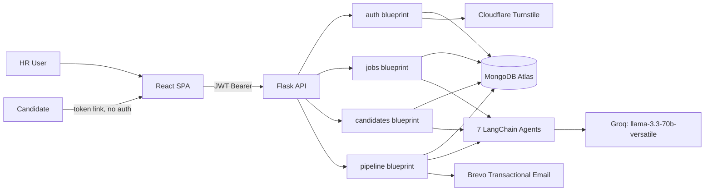

Here's the updated README with 2FA integrated throughout — new feature bullet, updated Auth API table, updated Security section, a new Engineering decision entry, and Roadmap checked off:

```markdown
# RecruitMate AI

> A multi-tenant recruitment platform that screens resumes, generates personalized interview questions, runs voice interviews through an AI interviewer, and auto-decides shortlist/reject outcomes — coordinated by seven purpose-built Groq-backed agents.

**[Live App](https://recruit-mate-chi.vercel.app) · [Backend Health](https://recruitmate-backend-zkru.onrender.com/api/health) · [Issues](https://github.com/bonamukkala-bot/RecruitMate/issues)**

---

## Snapshot

| | |
|---|---|
| **Status** | Live, single-maintainer, actively developed |
| **Category** | Full-stack SaaS — AI-assisted recruitment |
| **Backend** | Python 3.11 · Flask · MongoDB Atlas |
| **Frontend** | React (CRA) · Tailwind CSS |
| **AI** | Groq `llama-3.3-70b-versatile` via LangChain |
| **Deployment** | Render (API) · Vercel (SPA) |
| **License** | Not yet declared — see [License](#license) |

---

## The problem

Screening resumes, writing role-specific interview questions, running first-round interviews, scoring answers consistently, and notifying every candidate at every stage is repetitive and time-consuming when done manually for more than a handful of applicants per role, and inconsistent scoring across reviewers makes early-stage decisions hard to defend later.

## The approach

RecruitMate AI turns each step of early-stage hiring into a discrete, auditable agent call: parse the JD → score the resume against it → generate questions tailored to that candidate's matched/missing skills → run the interview → score the answers → decide the next step → notify the candidate. Every agent call is logged to a `pipeline` collection per candidate, so a decision can be traced back to the exact model output that produced it.

---

## Key features

- **AI JD generation** — a one-line role description is expanded into a structured job posting (title, required skills, experience, responsibilities, qualifications, type, location).
- **Resume screening with auto-reject** — resumes (typed or uploaded as PDF/DOCX) are scored 0–100 against the parsed JD; candidates below the configured threshold receive an automatic rejection email with no human step in between.
- **Per-candidate question generation** — questions are generated from that specific candidate's matched and missing skills, not a static question bank.
- **Token-secured voice interview portal** — candidates get a unique link (no account, no login) that drives a voice-based interview; the token itself is the access control.
- **Automated answer evaluation and decisioning** — each answer is scored, an overall score is computed, and the candidate is auto-shortlisted or auto-rejected against a threshold.
- **Role-aware scheduling** — next-step decisions (next round, HR call, reject) vary by threshold per seniority level (`senior` / `mid` / `junior`), not a single global cutoff.
- **AI candidate comparison** — given 2–3 shortlisted candidates for the same job, the model picks one and justifies it against actual matched/missing skills and scores rather than generic praise.
- **Kanban pipeline** — Screened → Shortlisted → Invited → Hired / Rejected.
- **Analytics + interview heatmap** — hiring funnel, score distributions, skills in demand, and a per-question breakdown of where candidates score weakest across interviews.
- **Bot-gated registration** — Cloudflare Turnstile is verified server-side before any account is created (see [Engineering decisions](#engineering-decisions)).
- **Opt-in TOTP two-factor authentication** — recruiters can enable app-based (Google Authenticator/Authy-style) 2FA from Settings; once enabled, login requires a time-based code in addition to the password, and disabling it requires re-entering the current password (see [Engineering decisions](#engineering-decisions)).

---

## How it works

```
Candidate resume (text/PDF/DOCX)
        │
        ▼
 JD Parser  ──▶  structured job requirements
        │
        ▼
 Resume Screener  ──▶  match_score, matched/missing skills
        │
        ├── score < threshold ──▶ Email Sender (auto-reject)
        │
        └── score ≥ threshold
                │
                ▼
        Question Generator ──▶ 8 tailored questions
                │
                ▼
        Public interview link created (token, no auth)
                │
                ▼
        AI Interviewer (voice) ──▶ candidate answers
                │
                ▼
        Answer Evaluator ──▶ overall_score
                │
        ┌───────┴────────┐
        ▼                ▼
  score ≥ threshold   score < threshold
        │                │
   Scheduler          Email Sender
  (next step,          (auto-reject)
   role-aware)
        │
        ▼
   Email Sender (notify)
```

Every agent call — including its input, output, and status — is written to the `pipeline` collection, keyed by company, candidate, and job.

---

## Architecture



The frontend never calls Groq, MongoDB, or Brevo directly — every external integration is mediated by the Flask API, which owns the JWT, the DB connection, and all agent invocations.

---

## Tech stack

| Layer | Technology | Purpose |
|---|---|---|
| Frontend | React (CRA), Tailwind CSS | SPA, styling |
| Routing | React Router v6 | Client-side routing |
| Data fetching | Axios | REST calls to the Flask API |
| Charts | Recharts | Analytics dashboard, heatmap |
| Animation | Framer Motion | UI transitions |
| Bot protection (client) | `react-turnstile` | Renders the Cloudflare Turnstile widget on Register |
| Client-side vision | TensorFlow.js, face-api.js, coco-ssd | In-browser interview integrity checks |
| Backend framework | Flask 3 | REST API, blueprint-based routing |
| Auth | PyJWT + bcrypt | Custom JWT issuance/verification — no third-party auth framework |
| 2FA | `pyotp` + `qrcode[pil]` | TOTP secret generation/verification, QR code provisioning |
| Database | MongoDB Atlas (PyMongo) | Companies, jobs, candidates, pipeline logs, OTPs |
| AI orchestration | LangChain (`langchain-groq`) | Structured prompt templates + JSON-mode parsing per agent |
| LLM | Groq — `llama-3.3-70b-versatile` | All 7 agents |
| Email | Brevo (`sib-api-v3-sdk`) | OTP, shortlist, rejection, scheduling, interview-link emails |
| File parsing | PyPDF2, python-docx | Resume/JD upload extraction |
| Bot protection (server) | Cloudflare Turnstile `siteverify` | Server-side token verification on `/register` |
| WSGI server | Gunicorn | Production serving on Render |
| Backend hosting | Render | API |
| Frontend hosting | Vercel | SPA |
| Uptime monitoring | UptimeRobot | Polls `/api/health` every 5 minutes |

---

## Engineering decisions

### Custom JWT instead of `flask-jwt-extended`

**Context:** The API needed stateless per-company authentication with an 8-hour expiry and a way to resolve "current company" from the token on every request.
**Options:** `flask-jwt-extended`, `flask-login`, or a minimal hand-rolled implementation.
**Choice:** A hand-rolled `@jwt_required` decorator and `get_current_company()` helper in `utils/auth_helper.py`, built directly on `PyJWT` and `bcrypt`.
**Reason:** The auth surface is small (register, OTP, login, one decorator) and didn't justify a framework dependency with its own configuration surface.
**Trade-off:** Token refresh, blacklisting, and other conveniences that `flask-jwt-extended` provides out of the box would need to be built manually if the auth requirements grow.

### TOTP-based 2FA, opt-in, layered on top of signup OTP

**Context:** Signup already required a one-time email OTP to activate an account — but that only verifies email ownership once, at registration. It provides no protection against a stolen password being used to log in later, which matters given recruiter accounts hold candidate PII across a multi-tenant setup.
**Options:** Reuse the existing Brevo email-OTP flow at every login, or add a separate app-based TOTP (Google Authenticator/Authy-style) layer.
**Choice:** TOTP via `pyotp`, opt-in per recruiter from a Settings page. Enabling requires scanning a QR code and confirming a live code (`/2fa/setup` → `/2fa/enable`); login checks `totp_enabled` and asks for a code after password verification succeeds (`requires_2fa` response); disabling requires re-entering the current password (`/2fa/disable`).
**Reason:** TOTP doesn't depend on email deliverability, works offline, and is the industry-standard second factor — meaningfully stronger than reusing email OTP, for comparable implementation cost.
**Trade-off:** Adds one more secret per company document (`totp_secret`) and a `pending_totp_secret` field during the setup handshake; the QR/secret flow requires clear UX so recruiters don't get locked out mid-setup.

### Token-based access for the public interview routes

**Context:** Candidates need to take an interview without creating an account.
**Options:** Require candidate signup/login, or issue a single-use/expiring token tied to the candidate record.
**Choice:** `POST /api/pipeline/interview/create/<candidate_id>` issues a token; `GET/POST /api/pipeline/interview/public/<token>` are intentionally unauthenticated and rely on the token as the access control.
**Reason:** Forcing candidates through account creation adds friction to a flow that should take minutes.
**Trade-off:** These routes currently have no rate limiting (tracked in [Limitations](#limitations)), so token guessing/brute-force is a live risk until that's added.

### Cloudflare Turnstile scoped to Registration only, verified server-side first

**Context:** The `/register` endpoint was open to scripted signups.
**Options:** Add CAPTCHA at the frontend only, add it globally across all routes, or scope it narrowly with server-side enforcement.
**Choice:** Turnstile (Managed mode) is rendered on the Register form only; the resulting token is sent as `turnstile_token` and verified against Cloudflare's `siteverify` endpoint as the *first* check inside `/api/auth/register` — before any database write or OTP email.
**Reason:** Login and all other routes didn't have the same abuse profile, and verifying server-side (not just gating the submit button client-side) means the check can't be bypassed by calling the API directly.
**Trade-off:** Adds an external dependency (Cloudflare) and a network round-trip to every registration attempt.

### `tlsAllowInvalidCertificates=True` on the MongoDB connection

**Context:** The PyMongo TLS handshake to Atlas failed inconsistently across the dev/deploy environments used for this project.
**Choice:** `utils/db.py` connects with `tls=True, tlsCAFile=certifi.where(), tlsAllowInvalidCertificates=True, tlsAllowInvalidHostnames=True`.
**Trade-off:** This weakens certificate validation and is not the setting you'd want in a security-sensitive production deployment — it's flagged here rather than hidden, and tightening it is a reasonable follow-up (see [Limitations](#limitations)).

---

## Project structure

```text
RecruitMate/
├── backend/
│   ├── agents/
│   │   ├── jd_parser.py            # JD → structured requirements
│   │   ├── resume_screener.py      # Resume vs. JD scoring
│   │   ├── question_generator.py   # Per-candidate question generation
│   │   ├── ai_interview.py         # Voice interview flow (intro/follow-up/close)
│   │   ├── answer_evaluator.py     # Answer scoring
│   │   ├── scheduler.py            # Next-step decisioning by score + seniority
│   │   ├── candidate_comparator.py # AI comparison of shortlisted candidates
│   │   └── email_sender.py         # All transactional email generation + sending
│   ├── routes/
│   │   ├── auth.py                 # register (Turnstile-gated) / verify-otp / login / me / 2fa (setup, enable, disable, status)
│   │   ├── jobs.py                 # CRUD, AI JD generation, analytics
│   │   ├── candidates.py           # screening, search, export, comparison
│   │   └── pipeline.py             # emails, interviews, scheduling, heatmap
│   ├── utils/
│   │   ├── db.py                   # MongoDB client, indexes
│   │   ├── auth_helper.py          # JWT decorator, current-company resolver, password hashing
│   │   └── file_extractor.py       # PDF/DOCX text extraction
│   ├── config.py                   # Env-var-backed settings
│   ├── app.py                      # App factory, blueprint registration, CORS
│   ├── test_backend.py             # Manual end-to-end integration script
│   └── test_agents.py              # Manual agent-level integration script
└── frontend/
    └── src/
        ├── api/                     # Axios wrapper per resource
        ├── context/AuthContext.jsx
        ├── components/{ui,layout}/  # Shared UI + layout shell
        └── pages/
            ├── auth/                 # Login (with 2FA code step), Register (Turnstile), VerifyOTP
            ├── settings/              # Security Settings — enable/disable 2FA
            ├── jobs/, candidates/, pipeline/
            ├── analytics/            # Analytics.jsx, Heatmap.jsx
            └── interview/            # Public voice InterviewPortal
```

---

## Quick start

### Prerequisites
- Python 3.11
- Node.js 18+
- A MongoDB Atlas cluster
- API credentials: [Groq](https://console.groq.com), [Brevo](https://www.brevo.com), [Cloudflare Turnstile](https://dash.cloudflare.com/?to=/:account/turnstile)

### Backend

```bash
git clone https://github.com/bonamukkala-bot/RecruitMate.git
cd RecruitMate/backend

python -m venv venv311
venv311\Scripts\activate        # Windows
# source venv311/bin/activate   # macOS/Linux

pip install -r requirements.txt
cp .env.example .env            # fill in real values, see below
python app.py                   # http://localhost:5000
```

### Frontend

```bash
cd ../frontend
npm install
cp .env.example .env            # fill in real values, see below
npm start                       # http://localhost:3000
```

---

## Environment variables

**`backend/.env`**

```env
GROQ_API_KEY=            # Groq API key — required, used by all 7 agents
MONGO_URI=                # MongoDB Atlas connection string — required
JWT_SECRET=                # Signing secret for issued JWTs — required
BREVO_API_KEY=              # Brevo transactional email API key — required for OTP/notification emails
BREVO_SENDER_EMAIL=          # Verified sender address in Brevo — required
BREVO_SENDER_NAME=            # Sender display name — required
TURNSTILE_SECRET_KEY=          # Cloudflare Turnstile secret — required for /register to succeed
FRONTEND_URL=                   # Deployed frontend origin, added to the CORS allow-list
```

**`frontend/.env`**

```env
REACT_APP_API_URL=              # Base URL of the Flask API, e.g. http://localhost:5000/api
REACT_APP_TURNSTILE_SITE_KEY=    # Cloudflare Turnstile site key (public)
```

`REACT_APP_*` variables are baked into the build at compile time — changing them on Vercel requires a redeploy, not just an env var update.

---

## API reference

Base path: `/api`. Routes marked 🔒 require `Authorization: Bearer <JWT>`. Routes marked 🔗 are unauthenticated and rely on a possession-based token instead.

**Auth**

| Method | Route | |
|---|---|---|
| POST | `/auth/register` | Create company account — Turnstile-verified |
| POST | `/auth/verify-otp` | Verify signup OTP |
| POST | `/auth/login` | Log in; returns `requires_2fa: true` instead of a token if 2FA is enabled and no code was sent |
| GET | `/auth/me` | 🔒 Current authenticated company |
| POST | `/auth/2fa/setup` | 🔒 Generate a new TOTP secret + QR code for setup |
| POST | `/auth/2fa/enable` | 🔒 Confirm a code against the pending secret and activate 2FA |
| GET | `/auth/2fa/status` | 🔒 Whether 2FA is currently enabled for the company |
| POST | `/auth/2fa/disable` | 🔒 Disable 2FA — requires current password |

**Jobs** 🔒 (all routes)

| Method | Route | |
|---|---|---|
| POST | `/jobs/` | Create a job posting |
| GET | `/jobs/` | List jobs |
| GET | `/jobs/<job_id>` | Job detail |
| PATCH | `/jobs/<job_id>/status` | Update job status |
| DELETE | `/jobs/<job_id>` | Delete job |
| POST | `/jobs/generate-jd` | AI-generate a full JD from one line |
| GET | `/jobs/analytics` | Hiring funnel + per-job stats |

**Candidates** 🔒 (all routes)

| Method | Route | |
|---|---|---|
| GET | `/candidates/` | List candidates |
| POST | `/candidates/<job_id>/screen` | Screen resume(s) against a job |
| GET | `/candidates/search` | Filtered search |
| GET | `/candidates/export` | CSV export |
| POST | `/candidates/compare` | AI comparison of 2–3 candidates |
| GET | `/candidates/<job_id>` | Candidates for a job |
| GET | `/candidates/detail/<candidate_id>` | Candidate detail |
| PATCH | `/candidates/detail/<candidate_id>/status` | Update pipeline status |
| DELETE | `/candidates/detail/<candidate_id>` | Delete candidate |

**Pipeline**

| Method | Route | | |
|---|---|---|---|
| POST | `/pipeline/send-email/<candidate_id>` | 🔒 | Send shortlist/interview-link email |
| POST | `/pipeline/evaluate/<candidate_id>` | 🔒 | Evaluate submitted interview answers |
| POST | `/pipeline/interview/start/<candidate_id>` | 🔒 | Start an AI interview session |
| POST | `/pipeline/interview/next` | 🔒 | Advance to next interview question |
| POST | `/pipeline/interview/close/<candidate_id>` | 🔒 | Close out an interview |
| POST | `/pipeline/schedule/<candidate_id>` | 🔒 | Role-aware next-step scheduling |
| GET | `/pipeline/logs/<candidate_id>` | 🔒 | Agent run history for a candidate |
| POST | `/pipeline/interview/create/<candidate_id>` | 🔒 | Generate a public interview token/link |
| GET | `/pipeline/interview/public/<token>` | 🔗 | Load interview by token |
| POST | `/pipeline/interview/public/<token>/submit` | 🔗 | Submit interview answers |
| POST | `/pipeline/schedule-offline/<candidate_id>` | 🔒 | Manually schedule an offline round |
| GET | `/pipeline/heatmap/jobs` | 🔒 | Jobs with heatmap data available |
| GET | `/pipeline/heatmap` | 🔒 | Interview performance heatmap data |

---

## AI system details

- **Model:** a single model, Groq's `llama-3.3-70b-versatile`, is used for every agent; only the `temperature` and prompt template differ per agent (e.g. `jd_parser` runs at `0.1` for deterministic extraction, `question_generator` at `0.7` for varied questions).
- **Orchestration:** each agent is a standalone LangChain `ChatGroq` call with a fixed system prompt instructing JSON-only output — there is no LangGraph state machine or multi-agent framework coordinating them; the *pipeline* (screen → generate questions → interview → evaluate → schedule) is orchestrated by the Flask route handlers, not by the LLM.
- **No retrieval/RAG:** there is no vector store or embedding step — resume and JD text are passed directly into the prompt as plain text.
- **Contract:** every agent function returns a `{"success": bool, "data": {...}}` shape; the calling route is responsible for persisting the result and deciding the next step based on the returned score.
- **Guardrails in prompts:** scoring rubrics are given explicitly in-prompt (e.g. 90–100 = Exceptional, 70–89 = Strong, 50–69 = Partial, <50 = Weak) to constrain the model rather than leaving scoring criteria implicit.

---

## Security

- **Authentication:** custom JWT (PyJWT), 8-hour expiry, verified on every protected route via a `@jwt_required` decorator; passwords hashed with bcrypt.
- **Signup verification:** email OTP required before an account is usable.
- **Two-factor authentication:** opt-in TOTP (`pyotp`), managed from a Security Settings page. Login checks `totp_enabled` after password verification and requires a valid time-based code before issuing a JWT (`valid_window=1` tolerates ~30s of clock drift). Disabling 2FA requires re-entering the current password, so a stolen session token alone can't turn protection off.
- **Bot protection:** Cloudflare Turnstile verified server-side on `/register`, ahead of any DB write (see [Engineering decisions](#engineering-decisions)). Not applied to any other route.
- **Public routes:** the interview-taking routes are deliberately unauthenticated and secured by an unguessable per-candidate token instead of a session.
- **Known gaps:** no rate limiting yet on the public interview routes; MongoDB TLS validation is currently relaxed (`tlsAllowInvalidCertificates=True`) — both are tracked in [Limitations](#limitations).

---

## Testing

There is no automated test suite (pytest/Jest) or CI pipeline yet. Two manual integration scripts exist and are run against a live local server:

```bash
# with the backend running locally on :5000
python backend/test_backend.py   # full flow: health check → auth → job → screening → evaluation
python backend/test_agents.py    # exercises each agent directly with fixed sample JD/resume text
```

---

## Limitations

- No automated test suite or CI — the two `test_*.py` scripts are manual, run-against-a-live-server integration checks, not a pytest suite.
- Public interview routes (`/pipeline/interview/public/*`) have no rate limiting, so token brute-forcing is not currently mitigated beyond the token's length/randomness.
- `ai_interview.py` contains code paths flagged by the maintainer as dead/unused and pending cleanup.
- MongoDB TLS certificate validation is relaxed (`tlsAllowInvalidCertificates=True`, `tlsAllowInvalidHostnames=True`) to work around an environment-specific handshake issue — not the setting you'd want in a hardened deployment.
- Single LLM provider (Groq) with no fallback — an outage or rate-limit on Groq's side stalls every agent, including resume screening and interview flows.
- No React error boundaries yet — an unhandled render error can blank the SPA rather than degrade gracefully.
- Offer letter generation is not yet built (see [Roadmap](#roadmap)).
- No 2FA recovery codes yet — if a recruiter loses access to their authenticator app, there's currently no backup-code or admin-reset flow (tracked in [Roadmap](#roadmap)).

---

## Roadmap

- [ ] One-click AI-generated offer letter (PDF download, optional email send) for shortlisted candidates
- [ ] Rate limiting on the public, unauthenticated interview routes
- [ ] React error boundaries around major page sections
- [ ] Remove dead code paths in `ai_interview.py`
- [ ] Automated test suite (pytest for backend agents/routes) and CI
- [ ] Tighten MongoDB TLS configuration
- [ ] 2FA recovery/backup codes for lost-device scenarios
- [x] Interview performance heatmap (weakest questions, radar chart, skill-gap breakdown)
- [x] Cloudflare Turnstile bot protection on Registration
- [x] Opt-in TOTP two-factor authentication (setup, enable, disable, login enforcement)

---

## Contributing

The repository is public. To contribute:

```bash
# 1. Fork, then clone your fork
git clone https://github.com/<your-username>/RecruitMate.git
cd RecruitMate

# 2. Create a branch
git checkout -b feature/your-feature-name

# 3. Set up backend and frontend as described in Quick Start

# 4. Make your changes, then verify manually
python backend/test_backend.py
python backend/test_agents.py

# 5. Commit and push
git commit -m "Add: your feature"
git push origin feature/your-feature-name

# 6. Open a pull request against main
```

There is no formal contribution guide or issue-labeling convention yet — open an issue first for anything non-trivial to align on approach before submitting a PR.

---

## License

No `LICENSE` file is currently present in the repository. Until one is added, all rights are reserved by default under standard copyright — treat the code as **not** open for reuse or redistribution unless you obtain explicit permission from the author.

---

## Author

**Bonamukkala Charan Reddy**
First-year B.Sc Computer Science, NIAT Hyderabad (BITS Pilani-affiliated)

- GitHub — [@bonamukkala-bot](https://github.com/bonamukkala-bot)
- Portfolio — [charan-me.vercel.app](https://charan-me.vercel.app)
- LinkedIn — [bonamukkala-charan](https://linkedin.com/in/bonamukkala-charan)
```
